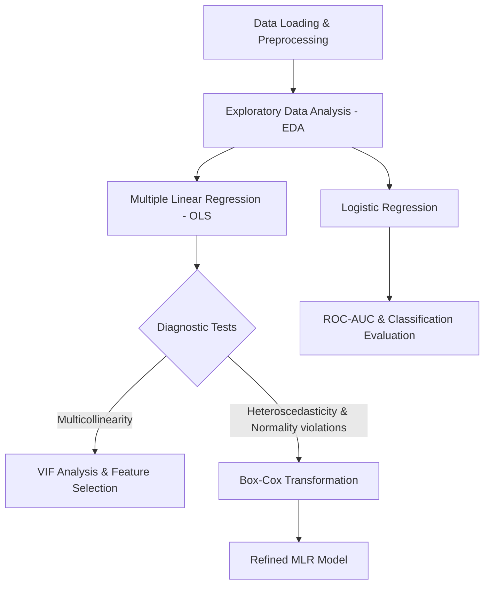

# HCMC PM2.5 Air Quality Regression Analysis
> **Phân tích Hồi quy Chất lượng Không khí PM2.5 tại Thành phố Hồ Chí Minh**

[](https://opensource.org/licenses/MIT)
[](https://www.python.org/)
[](https://doi.org/10.1016/j.dib.2022.108774)

---

## 📌 Project Overview / Tổng quan Dự án

### English
This repository contains a comprehensive data science project investigating the meteorological and spatial factors that influence **PM2.5 fine particulate matter concentrations** in Ho Chi Minh City (HCMC), Vietnam. 

Using hourly monitoring data from 2019 to 2021 (52,548 observations across 6 stations), this study employs **Multiple Linear Regression (MLR)** and **Logistic Regression** to model, predict, and classify air quality levels. The project is designed with academic rigor, incorporating extensive Exploratory Data Analysis (EDA), regression diagnostic tests (Multicollinearity, Heteroscedasticity, Normality), and Box-Cox transformation to address assumption violations.

### Tiếng Việt
Repository này chứa dự án khoa học dữ liệu toàn diện nghiên cứu về các yếu tố khí tượng và không gian ảnh hưởng đến **nồng độ bụi mịn PM2.5** tại Thành phố Hồ Chí Minh (TP.HCM), Việt Nam.

Sử dụng dữ liệu quan trắc theo giờ từ năm 2019 đến 2021 (52.548 quan sát tại 6 trạm trắc nghiệm), nghiên cứu này áp dụng **Hồi quy Tuyến tính Bội (MLR)** và **Hồi quy Logistic** để mô hình hóa, dự báo và phân loại các mức độ chất lượng không khí. Dự án được thiết kế chặt chẽ theo tiêu chuẩn học thuật, bao gồm Phân tích Khám phá Dữ liệu (EDA) chuyên sâu, các kiểm định vi phạm giả định hồi quy (Đa cộng tuyến, Phương sai sai số thay đổi, Phân phối chuẩn của phần dư) và phép biến đổi Box-Cox để tối ưu hóa mô hình.

---

## 📂 Repository Structure / Cấu trúc Thư mục

```text
hcmc-pm25-regression-analysis/
├── README.md                          # Project overview & documentation (Bilingual)
├── LICENSE                            # MIT License terms
├── requirements.txt                   # Required Python libraries
├── .gitignore                         # Git exclusion rules
├── data/
│   └── Air Quality Ho Chi Minh City.csv   # Raw dataset (HealthyAir Project)
├── notebooks/
│   └── PM25_HoChiMinh_Analysis.ipynb      # Main analysis Jupyter Notebook (Vietnamese)
├── report/
│   └── Báo_Cáo_PM25HCMC.docx              # Detailed project report (Vietnamese Word document)
└── references/
    └── dataset_source.md              # Detailed dataset source & APA citations
```

---

## 📊 Dataset Description / Mô tả Dữ liệu

### English
The dataset originates from the **HealthyAir project** (Data in Brief, 2023). It contains hourly measurements from 6 stations in HCMC:
- **Meteorological parameters**: Temperature (°C), Relative Humidity (%), Wind Speed (m/s), Wind Direction (°).
- **Temporal parameters**: Hour, Day, Month, Year, Season (Dry vs. Wet).
- **Target variable**: PM2.5 concentration ($\mu g/m^3$).

### Tiếng Việt
Dữ liệu nguồn được trích từ dự án **HealthyAir** (công bố trên tạp chí *Data in Brief*, 2023). Bộ dữ liệu chứa các phép đo hàng giờ từ 6 trạm quan trắc tại TP.HCM:
- **Thông số khí tượng**: Nhiệt độ (°C), Độ ẩm tương đối (%), Tốc độ gió (m/s), Hướng gió (°).
- **Thông số thời gian**: Giờ, Ngày, Tháng, Năm, Mùa (Mùa mưa vs. Mùa khô).
- **Biến mục tiêu**: Nồng độ bụi mịn PM2.5 ($\mu g/m^3$).

*Chi tiết về nguồn dữ liệu và trích dẫn khoa học được lưu tại [dataset_source.md](references/dataset_source.md).*

---

## ⚙️ Methodology & Workflow / Phương pháp & Quy trình Thực hiện

The study follows a standard academic data science pipeline:
Quy trình nghiên cứu tuân theo các bước khoa học chuẩn mực:



### 1. Exploratory Data Analysis (EDA) / Phân tích Khám phá Dữ liệu
- Distribution plots, correlation matrices, and spatial comparison across 6 stations.
- Temporal patterns (diurnal cycles, seasonal fluctuations).
- Trực quan hóa phân phối, ma trận hệ số tương quan, so sánh nồng độ giữa 6 trạm.
- Khảo sát xu hướng theo thời gian (chu kỳ ngày đêm, biến động theo mùa mưa/khô).

### 2. Multiple Linear Regression (MLR) / Hồi quy Tuyến tính Bội
- Built using OLS (Ordinary Least Squares) via `statsmodels`.
- Checked assumptions:
  - **Multicollinearity**: Checked via **Variance Inflation Factor (VIF)**.
  - **Heteroscedasticity**: Tested using the **Breusch-Pagan test**.
  - **Normality of Residuals**: Verified with the **Jarque-Bera test** and Q-Q plots.
- Applied **Box-Cox transformation** to stabilize variance and normalize residuals.
- Xây dựng mô hình OLS bằng thư viện `statsmodels`.
- Kiểm định các giả định quan trọng:
  - **Đa cộng tuyến**: Đánh giá qua hệ số phóng đại phương sai **VIF**.
  - **Phương sai sai số thay đổi**: Kiểm định **Breusch-Pagan**.
  - **Phân phối chuẩn của phần dư**: Kiểm định **Jarque-Bera** và đồ thị Q-Q.
- Áp dụng phép biến đổi **Box-Cox** để khắc phục vi phạm giả định và cải thiện độ chính xác.

### 3. Logistic Regression / Hồi quy Logistic
- Transformed PM2.5 into a binary outcome based on the air quality safety threshold.
- Evaluated performance using: **ROC-AUC**, Confusion Matrix, and Classification Report (Precision, Recall, F1-Score).
- Chuyển đổi nồng độ PM2.5 thành biến phân loại nhị phân dựa trên ngưỡng an toàn sức khỏe.
- Đánh giá mô hình bằng đường cong **ROC-AUC**, Ma trận nhầm lẫn (Confusion Matrix) và các chỉ số Precision, Recall, F1-Score.

---

## 📈 Key Findings / Kết quả Chính

- **Linear Model**: The Box-Cox transformed model significantly improved the residual distribution symmetry and addressed heteroscedasticity. Wind speed and relative humidity were found to have strong negative associations with PM2.5, whereas temperature showed a positive effect under specific conditions.
- **Mô hình tuyến tính**: Phép biến đổi Box-Cox giúp cải thiện đáng kể tính đối xứng của phần dư và giải quyết hiện tượng phương sai sai số thay đổi. Tốc độ gió và độ ẩm tương đối có mối quan hệ tỷ lệ nghịch mạnh mẽ với PM2.5, trong khi nhiệt độ thể hiện tác động tỷ lệ thuận dưới các điều kiện cụ thể.
- **Logistic Model**: Achieved a high **ROC-AUC score**, showing robust capability in predicting periods of unhealthy PM2.5 levels using meteorological predictors.
- **Mô hình Logistic**: Đạt điểm **ROC-AUC** ấn tượng, chứng minh khả năng dự báo chính xác các thời điểm nồng độ bụi mịn vượt ngưỡng nguy hại chỉ dựa trên các yếu tố thời tiết.

---

## 🚀 Setup & Execution / Hướng dẫn Cài đặt & Chạy dự án

### Prerequisites / Yêu cầu hệ thống
- Python 3.8 or higher.
- Jupyter Notebook or JupyterLab.

### Installation / Cài đặt

1. **Clone the repository / Tải repository về máy**:
   ```bash
   git clone https://github.com/tdat17a1/hcmc-pm25-regression-analysis.git
   cd hcmc-pm25-regression-analysis
   ```

2. **Create a virtual environment (Recommended) / Tạo môi trường ảo (Khuyến nghị)**:
   ```bash
   python -m venv venv
   source venv/bin/activate  # On Windows: venv\Scripts\activate
   ```

3. **Install dependencies / Cài đặt các thư viện**:
   ```bash
   pip install -r requirements.txt
   ```

4. **Launch Jupyter Notebook / Khởi động Notebook**:
   ```bash
   jupyter notebook notebooks/PM25_HoChiMinh_Analysis.ipynb
   ```

---

## 📜 License & Citation / Bản quyền & Trích dẫn

- **Code License**: This project is licensed under the **MIT License** - see the [LICENSE](LICENSE) file for details.
- **Data Source**: Please cite the original paper if you reuse the dataset (see details in [references/dataset_source.md](references/dataset_source.md)).

---

## ✉️ Contact / Liên hệ
- **Author**: tdat17a1
- **GitHub**: [@tdat17a1](https://github.com/tdat17a1)
